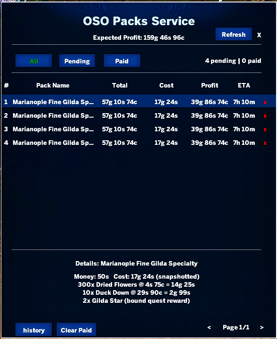

# OSO Packs Service

A lightweight ArcheRage addon that tracks your trade pack sales and tells you exactly how much profit you made on each one.

## What it does

- Logs every pack you sell with its total payout, material cost, and net profit
- Pulls live material prices from the auction house automatically
- Shows an ETA countdown until your gold arrives (delivery delay)
- Separates pending and paid packs so you know what's still in transit
- Displays an all-time history with total profit and your most-sold pack

## Installation

1. Download the latest release
2. Extract the folder into your ArcheRage addons directory
3. Enable **OPS** in the in-game addon manager and reload
